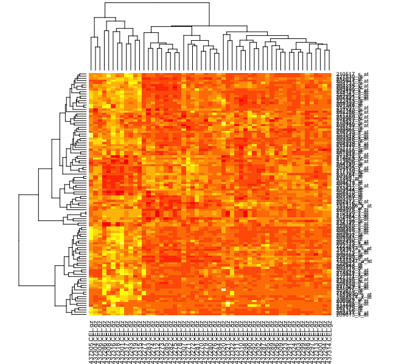

**Objective**: To use different screening techniques to distinguish patients with high risks from those with low risks for colon cancer recurrence and predicting their prognosis.

**Methods**: Colon cancer samples were collected from the Gene Expression Omnibus database along with The Cancer Genome Atlas. Data from GSE17537 were analyzed using the LIMMA method to identify the differentially expressed genes (DEGs). A PPI network was created and support vector machine (SVM) analysis was performed on the DEGs for screen for the feature genes. 

1. __Microarry Data__: The microarray data used in the analysis was obtained in the same manner as Xu et al.,. GSE17537 and GSE17538 (GEO; http://www.ncbi.nlm.nih.gov/geo/). contained 19 recurrence, 36 no-recurrence samples and 68 recurrence and 109 no-recurrence samples respectively.

2. __Data normalization__:The R statistical package was utilized in order to download, convert and normalize the downloaded files. All files were stored in variables and then normalized by using the rma (Robust Multi-Array Average expression measure) function. The data matrix was then extracted and identification of differentially expressed genes (DEGs)
	Once the data was normalized the differentially expressed genes (DEGs) were identified by the LIMMA package. This allowed for the recurrence and no-recurrence samples to be analyzed for the top genes. The same threshold of p<0.05 and |logFC(fold change)|>0.7 was used to identify the genes as stated in the Xu et al,. paper. 

3. __Analysis__
* Unsupervised hierarchical clustering analysis
	An supervised hierarchical clustering analysis was used to investigate the effectiveness of feature genes in distinguishing recurrence and no-recurrence samples. Clustering was performed and the results were visualized by a heat map. 

Figure 1.Heatmap to show similarity between samples. Higher similarity in dark orange and lower similarity in yellow

* SVM construction and Validation analysis	
An SVM model was constructed using GSE17537. To confirm the validity of the model the GSE1736 dataset was downloaded and used as the validation set. The SVM model was built in the same manner as the Xu et al., paper. The SVM model we generated has an accurate of 82%. Based on the use case in trying to differentiate recurrence for colon cancer patients this may be a useful tool to use among others. This may be useful to classify colon cancer patients with different prognosis and some genes in the their signature may represent new therapeutic targets. The datasets, especially the one chose for the initial model build was somewhat poor from a data quality perspective. Specifically the phenotype data was split across two separate characteristic channels. This leads us to question the rigor with which the study was performed.

**Results**: A total of 1207 genes were identified as DEGs between recurrence and no-recurrence samples. Using SVM analysis and five gene expression profile data confirmation, a 15-gene signature were identified as a predictor of recurrence risk and prognosis for colon cancer patients. 

**folder**

| **folder** | **desc**|
|------|----------|
| code | major code |
| data | macroarray data |
